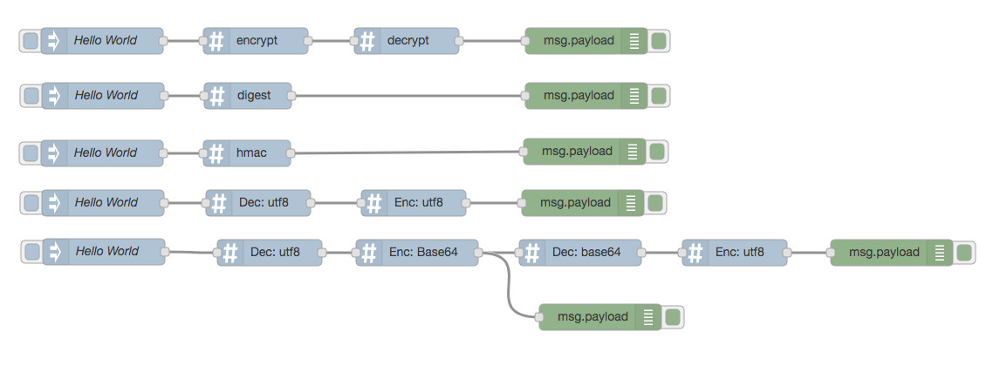

# node-red-contrib-crypto-js
Node-RED nodes using CryptoJS to encrypt and decrypt messages

# Install
npm install node-red-contrib-crypto-js

# Sample Flows

You can have access to this samples flows on `samples/flows.json` file.

# CryptoJS 
> JavaScript library of crypto standards.

Supported algorithms:   

Encrypt and Decrypt Nodes:
* crypto-js/aes
* crypto-js/des
* crypto-js/RC4
* crypto-js/Rabbit
* crypto-js/TripleDES

Digest Node
* crypto-js/md5
* crypto-js/sha1
* crypto-js/sha3
* crypto-js/sha224
* crypto-js/sha256
* crypto-js/sha384
* crypto-js/sha512
  
HMAC (Hash-based Message Authentication Code) Node
* crypto-js/hmac-md5
* crypto-js/hmac-sha1
* crypto-js/hmac-sha3
* crypto-js/hmac-sha224
* crypto-js/hmac-sha256
* crypto-js/hmac-sha384
* crypto-js/hmac-sha512

Encode and Decode
* crypto-js/enc-base64
* crypto-js/enc-Hex
* crypto-js/enc-Latin1
* crypto-js/enc-utf8
* crypto-js/enc-Utf16
* crypto-js/enc-Utf16BE
* crypto-js/enc-Utf16LE

# Request for new algorithms
Feel free to open an Issue for new algorithms, but please, keep in mind that this is a 
`crypto-js` Node-RED bridge, so only algorithms supported by underline framework will be implemented.
